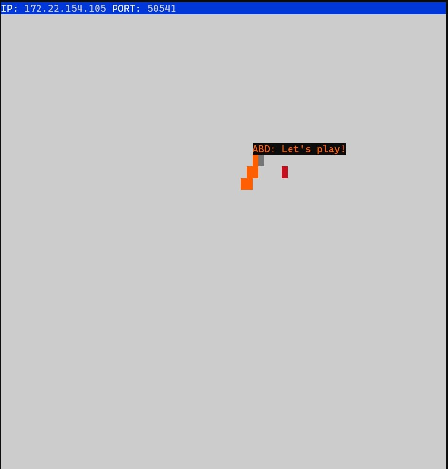

# Snake Client Project

The Snake Client Project is a JavaScript and NodeJS based implementation of the classic game Snake. The objective of the game is to control a snake, maneuvering it to eat pieces of food and grow in length. However, as the snake grows, it becomes increasingly challenging to avoid colliding with the side walls or its own body, as such collisions result in the snake's demise.

This is simply a multiplayer take on the genre.

Before you can run this client, you will need to be running the server side which you can download and install from here. 

## Purpose
BEWARE: This project was published for learning purposes. It is not intended for use in production-grade software.

This project was created and published by me as part of my learnings at Lighthouse Labs.

## Credits

This game is inspired by the game Snek created by Tania Rascia. The server code for this game was not written from scratch - it is a refashioned version of Rascia's game.

## Final Product

## Getting Started

- Follow steps inside the snek server repo to run the server side
- Run the development snake client using the `node play.js` command.

## Instructions

- Run the development snake client using the `node play.js` command.
- Use your `w, a, s, d` keys to navigate your snake up, down, left, or right respectively.
- Use your numbered keys `z, x, c` to send banter messages when playing with other players.
- Eat the red dots to grow your snake and gain points.
- Avoid colliding into the walls or into your own tail, otherwise, it's game over.
- Press `Cmd/Ctrl + C` to quit the game.